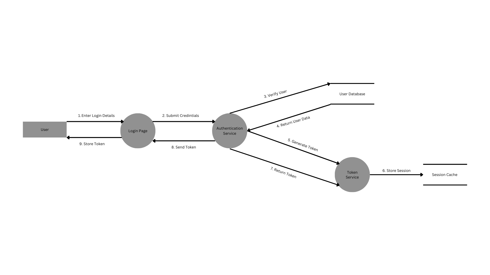

# STRIDE Threat Model Analysis - User Login System

## DFD

## 1. Spoofing
### Threats:
- Attacker impersonating legitimate users through stolen credentials
- Fake login UI mimicking the authentic interface
- Session hijacking through stolen tokens
- Man-in-the-middle attacks intercepting login requests

### Impact Points:
- User Interface (Login UI)
- Authentication Service
- Token Service

### Mitigations:
- Implement strong password policies
- Enforce multi-factor authentication (MFA)
- Use SSL/TLS for all communications
- Implement CSRF tokens
- Add rate limiting for failed login attempts
- Use secure session management

## 2. Tampering
### Threats:
- Modification of data in transit between components
- Unauthorized alterations to stored user data
- Token tampering attempts
- SQL injection attacks

### Impact Points:
- Network Communication Channels
- User Database
- Session Cache
- Authentication Tokens

### Mitigations:
- Implement message integrity checks
- Use prepared statements for database queries
- Apply digital signatures for tokens
- Implement proper input validation
- Use secure hash functions for passwords

## 3. Repudiation
### Threats:
- Users denying their actions
- Unauthorized password changes
- Disputed transactions
- Failed login attempts denial

### Impact Points:
- Authentication Service
- User Database
- Token Service

### Mitigations:
- Implement comprehensive audit logging
- Use secure timestamp services
- Maintain login attempt history
- Record IP addresses and device information
- Implement secure logging mechanisms

## 4. Information Disclosure
### Threats:
- Exposure of sensitive user data
- Token leakage
- Error messages revealing system details
- Cache data exposure
- Database credential exposure

### Impact Points:
- User Database
- Session Cache
- Network Communications
- Error Messages

### Mitigations:
- Encrypt sensitive data at rest
- Implement proper error handling
- Use secure session storage
- Apply principle of least privilege
- Implement data masking
- Regular security audits

## 5. Denial of Service
### Threats:
- Login request flooding
- Database connection exhaustion
- Token service overload
- Session cache overflow
- Network bandwidth consumption

### Impact Points:
- Login UI
- Authentication Service
- Database
- Token Service
- Session Cache

### Mitigations:
- Implement rate limiting
- Use CAPTCHA for repeated failed attempts
- Deploy load balancers
- Implement request throttling
- Monitor system resources
- Have failover mechanisms

## 6. Elevation of Privilege
### Threats:
- Unauthorized access to admin functions
- Token privilege escalation
- Database permission exploitation
- Service account compromise

### Impact Points:
- Authentication Service
- Token Service
- User Database
- System Services

### Mitigations:
- Implement robust role-based access control (RBAC)
- Regular privilege audits
- Proper session management
- Principle of least privilege
- Regular security updates
- Strong password policies for admin accounts

## Recommended Security Controls

### Authentication:
- Strong password requirements
- Multi-factor authentication
- Session timeout mechanisms
- Secure password reset process

### Authorization:
- Role-based access control
- Attribute-based access control
- Regular permission reviews
- Principle of least privilege

### Communication:
- TLS 1.3 for all connections
- Certificate pinning
- Secure key exchange
- API gateway implementation

### Monitoring:
- Security event logging
- Real-time alert system
- Regular audit reviews
- Anomaly detection